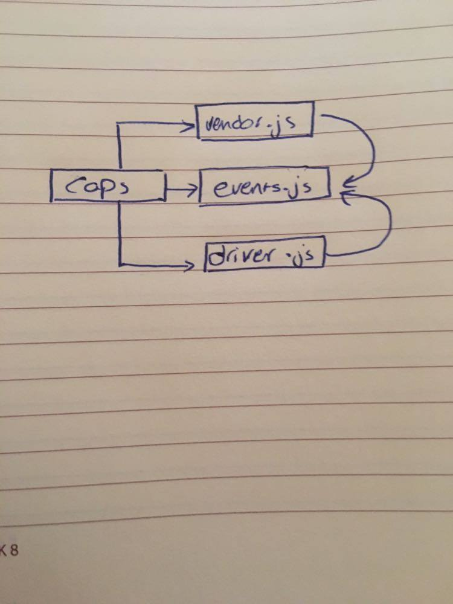

# LAB -16

## Project: Caps

### Author:Ahlam Alefishat

### Links and Resources

- [submission PR]()

### Modules
- Node.js

### Packages
- jest eslint dotenv
### Setup

#### `.env` requirements (where applicable)

i.e.

- `STORE`=ahlam's 

#### How to initialize/run your application (where applicable)

-  `npm start`
- `node caps.js`
- `nodemon`

#### How to use your library (where applicable)

#### Tests

- npm test

#### UML

